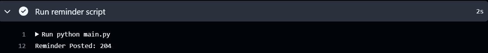
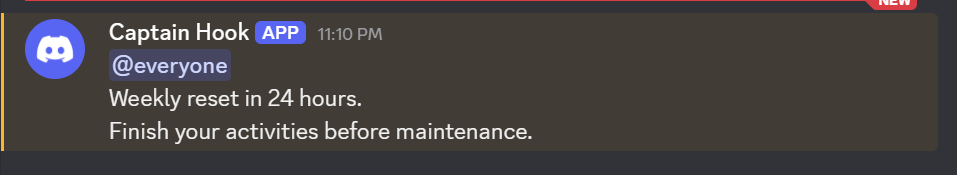

# Discord Weekly Reminder Bot ⏰


A lightweight automation project that sends scheduled reminder messages to a Discord channel using **Python**, **Discord Webhooks**, and **GitHub Actions**.

Originally inspired by a real-world need for weekly gaming reminders, this project evolved into a reusable automation pattern that can be adapted for notifications, reporting, and other scheduled workflows.

The workflow runs entirely in the cloud, eliminating the need for a local machine to stay online.

---

## 🚀 Features

* Automated weekly reminders
* Cloud-based scheduling with GitHub Actions
* Secure secret management using environment variables
* JSON-based message configuration
* Manual workflow execution for testing
* Lightweight and easily customizable

---

## 🛠 Tech Stack

* **Python**
* **GitHub Actions**
* **Discord Webhooks**
* **Requests**
* **python-dotenv**
* **JSON**

---

## ⚙️ How It Works

1. GitHub Actions triggers the workflow on a predefined schedule.
2. A temporary Ubuntu runner is created.
3. Python dependencies are installed.
4. Environment variables are loaded securely.
5. Configuration is read from `config.json`.
6. A POST request is sent to Discord using a webhook.
7. Discord returns status code **204**, confirming successful delivery.

---

## ⏰ Scheduling

This project uses GitHub Actions to execute reminders on a predefined schedule.

The workflow supports:

- Weekly scheduled execution
- Manual execution for testing
- Fully cloud-based operation
- Easily customizable timing through cron expressions

Because scheduling is handled by GitHub Actions, the automation continues to run even when the local machine is offline.

---

## 📁 Project Structure

```text
discord-weekly-reminder/
│
├── .github/
│   └── workflows/
│       └── weekly_reminder.yml
│
├── images/
│   ├── discord-message.png
│   └── github-actions-success.png
│
├── main.py
├── config.json
├── requirements.txt
├── .gitignore
└── README.md
```

---

## 🔧 Customization

The reminder message and whether reminders are enabled can be configured through `config.json`.

Example:

```json
{
  "message": "@everyone Weekly reset in 24 hours.",
  "enabled": true
}
```

### Disable Reminders

```json
{
  "message": "@everyone Weekly reset in 24 hours.",
  "enabled": false
}
```

### Change the Message

```json
{
  "message": "@everyone Monthly sales report is available.",
  "enabled": true
}
```

Although originally created for Discord gaming reminders, the same workflow can easily be adapted for:

* Weekly team notifications
* Sales or KPI updates
* Data pipeline monitoring alerts
* Scheduled business reminders
* Project status updates
* Automated report notifications

---

## 📚 Concepts Demonstrated

* API integration
* Environment variables and secrets management
* JSON configuration handling
* Modular Python functions
* HTTP requests and status codes
* Workflow automation
* Cloud-based scheduling
* Basic CI/CD concepts

---

## 📦 Installation

### Clone the repository

```bash
git clone https://github.com/yourusername/discord-weekly-reminder.git
```

### Install dependencies

```bash
pip install -r requirements.txt
```

### Create a `.env` file

```env
DISCORD_WEBHOOK=your_discord_webhook_url
```

### Run locally

```bash
python main.py
```

---

## 🔮 Future Improvements

* Multiple reminder schedules
* Rich Discord embed messages
* Retry logic for failed requests
* Structured logging
* Unit tests
* Configurable reminder templates

---

## 📸 Example Output

### GitHub Actions Execution

The workflow runs automatically on a schedule or can be triggered manually for testing. Successful runs return HTTP status code **204**, confirming that Discord accepted the message.



---

### Discord Notification

After the workflow executes successfully, the configured reminder is delivered to the Discord channel.



---

These screenshots demonstrate the end-to-end workflow:

**GitHub Actions → Python Script → Discord Webhook → Successful Delivery**


---

## 🎯 Learning Outcomes

This project was built to gain hands-on experience with practical automation using Python and GitHub Actions while exploring:

* API integrations
* Environment variables and secrets management
* Configuration management
* Scheduled workflows
* Cloud-based automation
* Basic CI/CD principles

What started as a simple script evolved into a fully automated cloud workflow and demonstrated how repetitive tasks can be transformed into reusable systems.

---

## 👤 Author

**Gaurav Yadav**

Aspiring Data Analyst passionate about analytics, automation, and building practical solutions with Python.

📌 Connect with me:

* **LinkedIn:** [www.linkedin.com/in/gaurav-yadav-data-analyst](http://www.linkedin.com/in/gaurav-yadav-data-analyst)
* **GitHub:** github.com/gyadav3151-da

Always open to connecting with fellow data professionals and discussing analytics, automation, and technology.

---
